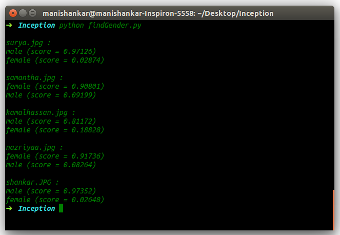
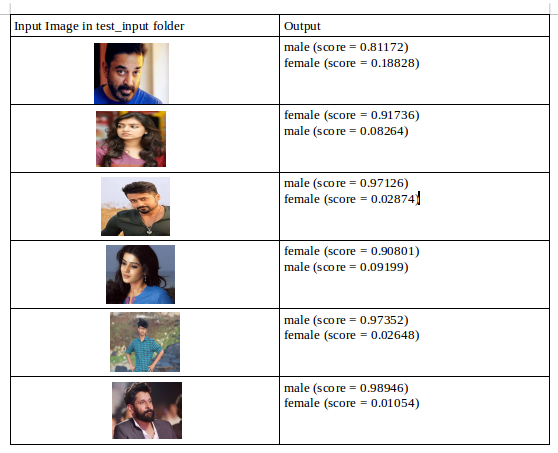

# Gender Detection using Tensorflow
We use the pre-trained Deep Learning Convolutional Neural Network model Inception to identify the gender of person from their photograph.

Refrence:[Tensorflow](https://www.tensorflow.org/)[Inception](https://research.googleblog.com/2016/03/train-your-own-image-classifier-with.html).

Since Inception in a pre-trained model we try to Transfer Learning to classify the gender with new set of male and female image dataset. 

This is a generic setup and can be used to classify almost any kind of image. I created a small demo that classifies two image data sets - my photos and my girlfriend's photos, and returns a prediction score denoting the possibility of it being my image or my girlfriend's image.

<br/>

## Requirements

Markup : 1. Python
         2. Tensorflow
<br/>

## Usage

### Prepare Training Dataset 
Create folder named ``training_dataset`` . Then create folders according to your class-label names(n folders for n classes).Then place all images into the corresponding folder(class-label).

> More the variations in images, more the accurate classification.

### Start Transfering Learning

```javascript
$ bash train.sh
```
Now the ``Inception`` model downloads and transferring learning occurs.

### Check for Results
Create a folder named ``test_input`` that contains all the images to be tested. 


```javascript
python findGender.py
```

The output will be the predictions for each image in the test data set in the folder ``test_input``.



## Results



## Check Performance metrics

```javascript
$ tensorboard --logdir .
```

## Credits

Training images are downloaded [here](http://cswww.essex.ac.uk/mv/allfaces/faces95.html).This repo designed and maintained by Dr Libor Spacek.
